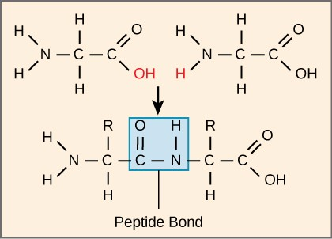
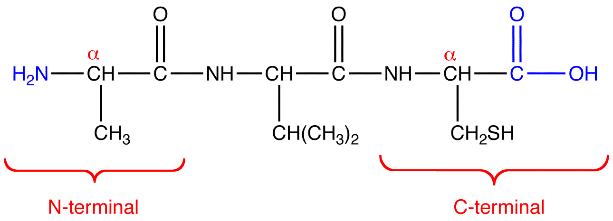
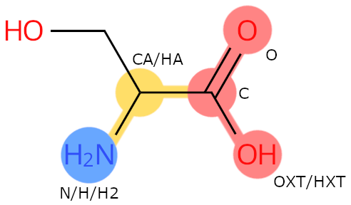

# Chem 274A - Final Assignment

This assignment has a Python component and a C++ component.
Each assignment combines concepts taught throughout the course.
This assignment is worth 20% of your final grade.

<div style="background-color: #fff3cd; color: #856404; padding: 15px; margin-bottom: 25px; border: 1px solid #ffeeba; border-radius: 4px;">
  
**Reminder: No AI Tools**

According to MSSE Department policy, use of AI tools is not permitted in Chem 274A. Do not use generative AI tools (e.g., ChatGPT, Claude, GitHub Copilot, or similar) for any part of this assignment, including planning, coding, or writing.

**Showing your work**

Your final assignment should show incremental development with at least two different commits over two different days of work. Assignments that do not show incremental development will incur a 5% penalty.

</div>

## C++ Final Project

### C++ General Requirements

These requirements apply to both C++ parts

* Code must be split into the appropriate header and source files
* Code should compile without warning on the default settings
* A separate `main.cpp` file should contains tests of your functionality
* `const` correctness is required!
* Practice defensive programming (for example, bounds checking)

### Compenstated Summation

The finite precision of most programming languages can result in loss of precision in mathematical expressions and rounding error
when accumulating large numbers of values, or in particular, numbers of very different magnitudes.

For example, think of the following expression:

$$
10000 + 8.0\times 10^{-13} + 8.0\times 10^{-13} + 8.0\times 10^{-13} + 8.0\times 10^{-13} + 8.0\times 10^{-13}
$$

You would expect result to be $10000.000000000004$. However, if you were to try this in a python interpreter
                           

```python
>>> 10000 + 8.0e-13 + 8.0e-13 + 8.0e-13 + 8.0e-13 + 8.0e-13
10000.0
```

Morever, if you group the smaller exponents so that that sum is done first (or reorder your expression),
you can get the correct answer

```python
>>> 10000 + (8.0e-13 + 8.0e-13 + 8.0e-13 + 8.0e-13 + 8.0e-13)
10000.000000000004
>>> 8.0e-13 + 8.0e-13 + 8.0e-13 + 8.0e-13 + 8.0e-13 + 10000
10000.000000000004
```

The reson for the weird behavior is that the result is rounded after each addition, resulting
in roundoff error. There is not enough precision in a double-precision floating point to store
the result of `10000 + 8.0e-13`, although there is enough to store the result of `10000 + 4.0e-12`.

A lot of times programmers ignore this, and for the most part it makes little difference. When summing large
arrays of numbers with varying magnitudes, though it can matter. It can also show up when subtracting
nearly-equal numbers

```python
>>> 1e9 + (1.2345670 - 1.2345665)
1000000000.0000005
>>> 1e9 + 1.2345670 - 1.2345665
1000000000.0000006
```

One solution of this is to use the *compensated summation* algorithm. Your task is to implement this function
for generic containers that hold double precision numbers (`vectors`, `array`, `list`).

#### Algorithm

The compensated summation algorithm, also called Kahan summation algorithm, involves a variable that accumulates
small roundoff errors so that it can be added back. This effectively extends the precision of your calculation
without requiring all math to be done in higher precision.

The pseudocode for the algorithm is 

```
function CompensatedSum(input)
    var sum = 0.0
    var c = 0.0  // A running compensation variable

    // The array input has elements indexed input[1] to input[input.length].
    for i = 1 to input.length do
        var y = input[i] - c
        var t = sum + y  // may lose precision!

        // (t - sum) cancels the high-order part of y;
        // subtracting y recovers negative (low part of y)
        c = (t - sum) - y

        sum = t

    // Next time around, the lost low part will be added to y in a fresh attempt.
    next i

    return sum
```

See [the wikipedia article](https://en.wikipedia.org/wiki/Kahan_summation_algorithm) for more information.

#### Your tasks

**Note:** Write your code in the `csum` subdirectory

Write a `compensated_sum` function.

* Create a `main.cpp` file that only includes the `main()` function. This will be used for testing
* You must implement the `compensated_sum` function in a separate file. Think about what type of file you want.
* The function must be generic and able to work with containers of any type (that stores doubles)
* Write some tests in the `main()` function. Include the one shown above, as well as an extreme variation
   with 100,000 small numbers and one big number. Compare with a straightforward, non-compensated summation (ie, using the standard library).

**Remember the general requirements above.**

### Adjacency Matrices & Graph Walks

**See also:** For much more information about graph theory in chemistry, see ["Handbook of Chemoinformatics Algorithms"](https://libproxy.berkeley.edu/login?qurl=https%3A%2F%2Fdoi.org%2F10.1201%2F9781420082999) (this is a Berkeley library link to the full texbook)

As we've seen, cheminformatics borrows heavily from graph theory. The concepts of nodes, edges, and walks come
from graph theory. Here is a water molecule with labeled atoms.


Given that atoms and bonds map to nodes (or vertices) and edges, respectively, we will define a *walk* as a sequence of nodes/atoms and edges/bonds where each consecutive nodes are adjacent (connected by an edge).
For example, given a molecule of water labeled as above, `H1-O2` would be a walk of length 1, and `H1-O2-H3`
would be a walk of length 2. The length of a walk is defined as the number of edges it touches.

One interesting property to consider is the number of paths from one atom to another. You *could* do this by
doing some graph searches, but there is a simpler way - via the *adjacency matrix*.

The adjacency matrix $\mathbf{A}$ is a square, symmetric, $N \times N$ matrix (where $N$ is the number of atoms).
The elements of the adjacency matrix are $1$ if the two atoms are connected by a bond, otherwise zero.
The diagonal is zero. For example, the adjacency matrix for the water molecule above is

$$
\mathbf{A} = \left[
\begin{matrix}
   0  &  1  &  0 \newline
   1  &  0  &  1 \newline
   0  &  1  &  0
\end{matrix}
\right]
$$

where the first row and column refer to atom 1 (hydrogen on the left), etc. Note that this kind of adjacency matrix does not take bond order into account.

An elegant property of the adjacency matrix is that elements of the $k$-th power of the matrix
correspond to the number of walks between atoms - $[\mathbf{A}^k]_{ij}$ is the number
of walks of length $k$ between elements $i$ and $j$.

For our water example, 

$$
\mathbf{A}^2 = \left[
\begin{matrix}
   1  &  0  &  1 \newline
   0  &  2  &  0 \newline
   1  &  0  &  1
\end{matrix}
\right]
$$

That means there is one walk of length 2 from `H1` to itself, and two from `O2` to itself. There is one walk
from `H1` to `H2` of length 2.

Therefore, simply by taking powers of the adjacency matrix, we can determine the number of walks between atoms
in a molecule.

In addition there are other interesting properties that can be computed from the adjacency matrix. Namely, the
*degree* of a node/vertex is the number of bonds it has. A vector that contains all the degrees of the molecule
can then be computed. Think about how you can compute that from the adjacency matrix.

For example, The degree of the oxygen atom in water is 2, while the degree of the hydrogens is 1 each.
The degree vector would be `(1, 2, 1)` given the above ordering.


#### Your tasks

**Note:** Write your code in the `amat` subdirectory. 

* Write a `Molecule` class. This will be a little different than what you have seen before. This
  class will not take/store coordinates at all. It should be constructed from only a vector of symbols (strings) and a vector of `std::pair`. The pair will have two integers, corresponding to a pair of atoms that are bonded.
* The only constructor for the class is the one mentioned above
* A method for obtaining the adjacency matrix is required
* The class will be declared in a header file and defined in another source file.
* There will be a `main.cpp` file that includes some tests.
* The class will have a method `nwalks` that takes three parameters - the length, and then indices
   of two atoms. This will compute the number of walks of the given length between the two atoms.
* The class will have a method `degrees` which will return an Eigen vector of degrees for the whole
   molecule.
* Write a `README.md` file containing a reflection of the choices you made designing your class. Include
  decisions about `const`, passing and returning by reference or value, and how/when data is stored.

**Hints:** Using Eigen is encouraged. Think about the data type you are storing in the matrices/vectors.
Consult the [Eigen documentation](https://eigen.tuxfamily.org/index.php?title=Main_Page)
if you are wondering about functionality.

**Note:** The examples above used 1-based ordering. In code, use 0-based (ie, 0 would be the first hydrogen, 1 is the oxygen, 2, is the other hydrogen.)

Do not include the whole Eigen source in your repo. Assume the person compiling your code has it
installed.

**Remember the general requirements above.**

## Python Final Project 

In Problem Set 5 you built a `Residue` class and a small residue library based on idealized residue templates in CIF format. 

For the final project, you will use your residue class as a pieces for a **peptide builder** in Python. Your peptide builder will create and visualize a 3D linear chain of amino acids specified by sequence. Your goal will be to apply the programming and software engineering principles you learned in Chem 274A to this problem.

A peptide is a short chain of amino acids (a long chain is a protein). You can see a bit more [here](https://www.peptidesciences.com/peptide-information/peptides-vs-proteins/). You will write Python code to build a linear peptide chain for the final, though it is possible to extend this builder to other geometries. 

<div style="background-color: #d4edda; color: #155724; padding: 15px; margin-bottom: 25px; border: 1px solid #c3e6cb; border-radius: 4px;">
  
**Peptide and Polymer Structure**

For this assignment, you will be building linear peptide chains. 
This is is a **very unrealistic conformation** for peptides. However, this kind of approximation is used for short peptides sometimes for input into molecular dynamics simulations.

The shape and conformation of peptides and proteins is considered to be a "Scientific Grand Challenge", which dramatically advanced by Google DeepMind's 2020 model AlphaFold.

If you are interested in real 3D structure of proteins and peptides, you should check out things like the [Protein Data Bank](https://www.rcsb.org/), [AlphaFold](https://alphafoldserver.com/) (from Google), or [ESMFold](https://esmatlas.com/resources?action=fold) (from Meta)

</div>


## Background: Peptide Chains & Atom Naming Conventions

To create a peptide chain, you will have to load residue templates, translate them in space, remove atoms, and create bonds between residues. A peptide chain forms when amino‑acid residues join through peptide bonds, created via a dehydration reaction:



**Image from [Introduction to Molecular Biology, Chapter 3. Amino Acids and Proteins; e-textbook, Roger Williams University](https://rwu.pressbooks.pub/bio103/chapter/amino-acids-and-proteins/)**

This means a new bond is made between the **C** atom of residue *i* and the **N** atom of residue *i+1*, and specific atoms are removed (the “leaving group”). When you specify an amino acid sequence, it has directionality. The sequence `AVC` has `A` at the N-terminus and `C` at the C terminus. This is a different peptide than `CVA`.



**Image from [Chemitry LibreTexts](https://chem.libretexts.org/Ancillary_Materials/Reference/Organic_Chemistry_Glossary/N-Terminal)**

[Our residue templates follow conventions set by the World Wide PDB](https://www.wwpdb.org/documentation/peptides-remediation) (the ideal coordinates came from the PDB, actually!) The image below highlights the parts of the amino acids, along with the atoms that are leaving groups in peptide bond formation. These names match the names that are in your CIFs.



* **N‑terminal side (blue)**

  * Linked amino nitrogen is always named **N**.
  * Hydrogens are named:
    * One hydrogen: **H**
    * Two hydrogens: **H**, **H2** (H2 is the leaving atom)
    * Three hydrogens: **H**, **H2**, **H3** (H2 & H3 are leaving atoms)

* **Backbone alpha carbon (yellow)**
  * The carbon bonded to both the amino group and the side chain is named **CA**.

* **C‑terminal side (red)**
  * Carboxyl carbon is always **C**.
    * **OXT** and **HXT** are leaving atoms during peptide‑bond formation.

---
<div style="background-color: #d1ecf1; color: #0c5460; padding: 15px; margin-bottom: 25px; border: 1px solid #bee5eb; border-radius: 4px;">

**A Note on Look-Ups**

Once you start building peptide chains, you repeatedly need to answer questions like:

* "Where is the N atom of this residue?"
* "Connect the C of residue *i* to the N of residue *i+1*."

If you store atoms in a simple list and search by looping, every lookup is **O(N)** in the number of atoms. For small examples this is fine, but it does not scale well and makes your code harder to reason about.

A common alternative is to:

* Store **coordinates** in a single `numpy.ndarray` of shape `(N, 3)` so that you can translate an entire residue with code like `coords += vector`.
* Store **atom names** in a separate list.
* Maintain a small **index map**: a dictionary from `atom_name -> row_index`, so lookups like `"CA"` → index are effectively **O(1)**.

You are not required to implement this exact layout, but you should think about this “lookup problem” and choose data structures that make your life easier.
</div>

### Requirements

For your peptide builder, you should consider how to demonstrate principles you have learned in Chem 274A. Some of the requirements listed below have questions that should be addressed in your project documentation. **No rubric** is provided in advance for the final.

You will build on your PS5 Residue class and create a new Peptide class, along with any helper functions you need. You may edit the internals of your Residue class (how information is stored), but you should maintain the same interface as outlined in PS5. You can add additional methods to your class, but you should not modify or remove the behavior of existing methods. In software development, this is called keeping backwards compatbility.

Your project must include the following:

**Residue Class (building on PS5)**

* A Residue class that continues the interface introduced in PS5.

* The `create_residue` factory function from PS5 that loads a residue from your data directory.

* A mechanism to set coordinates of all atoms in the residue at once. This mechanism should validate the coordinates shape.

* A working `remove_atom(name)` method that removes an atom from the residue. This method should ensure that the internal representation of the residue is consistent.

* A mechanism to compute the backbone N→C vector for a residue.

* At least one custom exception for error handling

* Testing using `pytest` for your `Residue` class. You should start with the tests from Problem Set 5 and add new tests for new functionality of your class.

**Peptide Class**

Your Peptide class should:

* Be constructible from a one‑letter amino‑acid sequence (e.g., "AGDV").

* Internally convert one‑letter codes to three‑letter codes, loading residue templates with `from_cif` or `create_residue`.

* Have a one letter sequence representation, and a three letter sequence representation (i.e. - `Ala-Gly-Val`)

* Give each residue in the peptide chain a unique name.

* Allow the user to access a residue using slicing (`[]`)

* Place residues along an extended chain. You can do this by translating coordinates along each backbone vector + an additional vector representing the bond length. The bond length for an amide bond is 1.33 angstrom.

* Your peptide class should connect the residues in the chain using amide bonds. This means you will need to remove leaving atoms from your residues and add bonds between residues.

* You should have a `bonds` attribute or property that gives a list of bonds for the full peptide. The format of this list should be `[(resname1, atom1), (resname2, atom2), weight]`

* Testing for your `Peptide` class using `pytest`

**Visualization**

* Your project must include 3D visualization capability using matplotlib. Use matplotlib 3D plotting to draw atoms as scatter points in 3D and bonds as lines between your atoms. Your atoms should be colored using CPK coloring and large enough to see when plotted. Your function or method should be able to both show the plot or optionally save to a file.

**Magic Methods (Choose at Least Two)**

Implement at least two of the following magic methods in Residue and/or Peptide (in addition to the required one listed above):

* `__repr__` or `__str__`

* `__len__`

* `__getitem__`

* `__iter__`

* `__contains__`

**Demo Script**  
 Create `demo.py` that demonstrates your Python API by:
   1. Building a peptide from sequence
   2. Accessing individual residues
   3. Getting atom information
   4. Visualizing the result
Include comments explaining each step.


**Makefile**

Include a `Makefile` with an `environment` target and a target called `visualize` to visualize `GIGAVLKVLTTGLPALISWIKRKRQQ` (A Python CLI might be useful here!). Have the target save to file `melittin.png`. For fun, you can see the real structure on [Wikipedia](https://en.wikipedia.org/wiki/Melittin) or through [ESMFold](https://esmatlas.com/resources/fold/result?fasta_header=&sequence=GIGAVLKVLTTGLPALISWIKRKRQQ). Note how different the real peptide structure is from your idealized linear chain!

**Optional Extra Credit (5/100 points max)**  
Profile your peptide builder using methods from Problem Set 4 on a large peptide. In your README discussion include a profiling visualization and discuss any bottlenecks present in your code and how you might address them. Clearly label your discussion as **EXTRA CREDIT** under your discussion questions.


### Documentation and Reflection

Include a `README` with an overview of your project including how to install and run your code and use your `Makefile`.

Also include answers to the following questions:

1. Describe how you ensured that all related internal data structures for your `Residue` and `Peptide` classes stayed consistent as your objects changed (for example, atom lists, coordinate arrays, bond lists, and lookup maps). What Python language features, if any, did you use to help with this?

2. Discuss how (or whether) your project uses composition, encapsulation, and inheritance. Give at least one concrete example for each used, and briefly explain why this design is or is not appropriate for your peptide builder. 

3. Explain how you chose and managed the data types used in your project (lists, dicts, NumPy arrays, custom objects). Why were these choices appropriate, and how did they help you ensure correctness, avoid errors, or simplify specific operations?

4. Which magic methods did you choose to implement and why? How do these help with class design, consistency, or user interface?

<script type="text/javascript" src="http://cdn.mathjax.org/mathjax/latest/MathJax.js?config=TeX-AMS-MML_HTMLorMML"></script>
<script type="text/x-mathjax-config">
    MathJax.Hub.Config({ tex2jax: {inlineMath: [['$', '$']]}, messageStyle: "none" });
</script>
