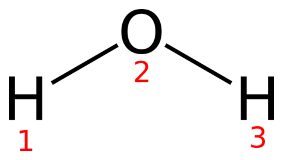
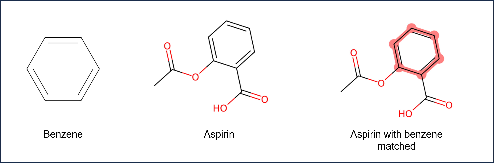
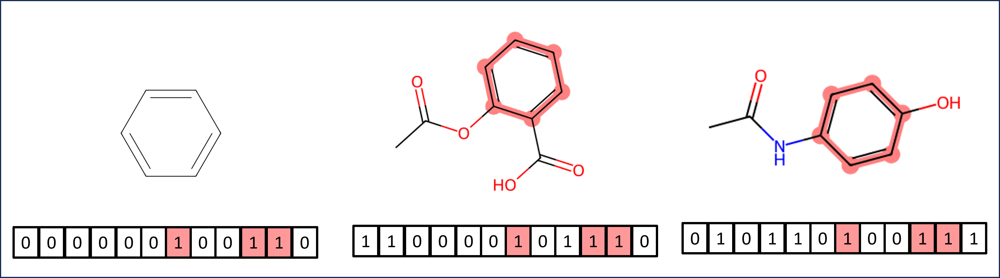

# Chem 274A - Final Assignment

This assignment has a Python component and a C++ component.
Each assignment combines concepts taught throughout the course.
This assignment is worth 20% of your final grade.

**Like the Problem Sets, your commits should show incremental development of your code.**

## C++ Final Project

### General Requirements

These requirements apply to both C++ parts

* Code must be split into the appropriate header and source files
* A separate `main.cpp` file should contains tests of your functionality
* `const` correctness is required!
* Code should compile without warning on the default settings

### Compenstated Summation

The finite precision of most programming languages can result in loss of precision in mathematical expressions and rounding error
when accumulating large numbers of values, or in particular, numbers of very different magnitudes.

For example, think of the following expression:

$$
10000 + 8.0\times 10^{-13} + 8.0\times 10^{-13} + 8.0\times 10^{-13} + 8.0\times 10^{-13} + 8.0\times 10^{-13}
$$

You would expect result to be $10000.000000000004$. However, if you were to try this in a python interpreter
                           

```python
>>> 10000 + 8.0e-13 + 8.0e-13 + 8.0e-13 + 8.0e-13 + 8.0e-13
10000.0
```

Morever, if you group the smaller exponents so that that sum is done first (or reorder your expression),
you can get the correct answer

```python
>>> 10000 + (8.0e-13 + 8.0e-13 + 8.0e-13 + 8.0e-13 + 8.0e-13)
10000.000000000004
>>> 8.0e-13 + 8.0e-13 + 8.0e-13 + 8.0e-13 + 8.0e-13 + 10000
10000.000000000004
```

The reson for the weird behavior is that the result is rounded after each addition, resulting
in roundoff error. There is not enough precision in a double-precision floating point to store
the result of `10000 + 8.0e-13`, although there is enough to store the result of `10000 + 4.0e-12`.

A lot of times programmers ignore this, and for the most part it makes little difference. When summing large
arrays of numbers with varying magnitudes, though it can matter. It can also show up when subtracting
nearly-equal numbers

```python
>>> 1e9 + (1.2345670 - 1.2345665)
1000000000.0000005
>>> 1e9 + 1.2345670 - 1.2345665
1000000000.0000006
```

One solution of this is to use the *compensated summation* algorithm. Your task is to implement this function
for generic containers that hold double precision numbers (`vectors`, `array`, `list`).

#### Algorithm

The compensated summation algorithm, also called Kahan summation algorithm, involves a variable that accumulates
small roundoff errors so that it can be added back. This effectively extends the precision of your calculation
without requiring all math to be done in higher precision.

The pseudocode for the algorithm is 

```
function CompensatedSum(input)
    var sum = 0.0
    var c = 0.0  // A running compensation variable

    // The array input has elements indexed input[1] to input[input.length].
    for i = 1 to input.length do
        var y = input[i] - c
        var t = sum + y  // may lose precision!

        // (t - sum) cancels the high-order part of y;
        // subtracting y recovers negative (low part of y)
        c = (t - sum) - y

        sum = t

    // Next time around, the lost low part will be added to y in a fresh attempt.
    next i

    return sum
```

See [the wikipedia article](https://en.wikipedia.org/wiki/Kahan_summation_algorithm) for more information.

#### Your tasks

**Note:** Write your code in the `csum` subdirectory

Write a `compensated_sum` function.

* Create a `main.cpp` file that only includes the `main()` function. This will be used for testing
* You must implement the `compensated_sum` function in a separate file. Think about what type of file you want.
* The function must be generic and able to work with containers of any type (that stores doubles)
* Write some tests in the `main()` function. Include the one shown above, as well as an extreme variation
   with 100,000 small numbers and one big number. Compare with a straightforward, non-compensated summation (ie, using the standard library).

**Remember the general requirements above.**

### Adjacency Matrices & Graph Walks

As we've seen, cheminformatics borrows heavily from graph theory. The concepts of nodes, edges, and walks come
from graph theory. Here is a water molecule with labeled atoms.



Given that atoms and bonds map to nodes (or vertices) and edges, respectively, we will define a *walk* as a sequence of nodes/atoms and edges/bonds where each consecutive nodes are adjacent (connected by an edge).
For example, given a molecule of water labeled as above, `H1-O2` would be a walk of length 1, and `H1-O2-H3`
would be a walk of length 2. The length of a walk is defined as the number of edges it touches.

One interesting property to consider is the number of paths from one atom to another. You *could* do this by
doing some graph searches, but there is a simpler way - via the *adjacency matrix*.

The adjacency matrix $\mathbf{A}$ is a square, symmetric, $N \times N$ matrix (where $N$ is the number of atoms).
The elements of the adjacency matrix are $1$ if the two atoms are connected by a bond, otherwise zero.
The diagonal is zero. For example, the adjacency matrix for the water molecule above is

$$
\mathbf{A} = \begin{bmatrix}
   0  &  1  &  0 \\
   1  &  0  &  1 \\
   0  &  1  &  0
\end{bmatrix}
$$

where the first row and column refer to atom 1 (hydrogen on the left), etc. Note that this kind of adjacency matrix does not take bond order into account.

An elegant property of the adjacency matrix is that elements of the $k$-th power of the matrix
correspond to the number of walks between atoms - $[\mathbf{A}^k]_{ij}$ is the number
of walks of length $k$ between elements $i$ and $j$.

For our water example, 

$$
\mathbf{A}^2 = \begin{bmatrix}
   1  &  0  &  1 \\
   0  &  2  &  0 \\
   1  &  0  &  1
\end{bmatrix}
$$

That means there is one walk of length 2 from `H1` to itself, and two from `O2` to itself. There is one walk
from `H1` to `H2` of length 2.

Therefore, simply by taking powers of the adjacency matrix, we can determine the number of walks between atoms
in a molecule.

In addition there are other interesting properties that can be computed from the adjacency matrix. Namely, the
*degree* of a node/vertex is the number of bonds it has. A vector that contains all the degrees of the molecule
can then be computed. Think about how you can compute that from the adjacency matrix.

For example, The degree of the oxygen atom in water is 2, while the degree of the hydrogens is 1 each.
The degree vector would be `(1, 2, 1)` given the above ordering.


#### Your tasks

**Note:** Write your code in the `amat` subdirectory. 

* Write a `Molecule` class. This will be a little different than what you have seen before. This
  class will not take/store coordinates at all. It should be constructed from only a vector of symbols (strings) and a vector of `std::pair`. The pair will have two integers, corresponding to a pair of atoms that are bonded.
* The class only constructor for the class is the one mentioned above
* A method for obtaining the adjacency matrix is required
* The class will be declared in a header file and defined in another source file.
* There will be a `main.cpp` file that includes some tests.
* The class will have a method `nwalks` that takes three parameters - the length, and then indices
   of two atoms. This will compute the number of walks of the given length between the two atoms.
* The class will have a method `degrees` which will return an Eigen vector of degrees for the whole
   molecule.

**Hints:** Using Eigen is encouraged. Think about the data type you are storing in the matrices/vectors.
Consult the [Eigen documentation](https://eigen.tuxfamily.org/index.php?title=Main_Page)
if you are wondering about functionality.

**Note:** The examples above used 1-based ordering. In code, use 0-based (ie, 0 would be the first hydrogen, 1 is the oxygen, 2, is the other hydrogen.)

Do not include the whole Eigen source in your repo. Assume the person compiling your code has it
installed.

**Remember the general requirements above.**

## Python Final Project 

As discussed in Problem Set 3, graphs are the basis of many type of digital representations of molecules. 

In this project, you will use Python to create a graph representation of a molecule, creating a `Molecule` class.
The `Molecule` class that you create can be screened for particular functional groups (a "substructure search").

A substructure search lets medicinal chemists find molecules that contain a particular functional group.
In chemistry, a functional group is a group of atoms that have a particular chemical behavior.
If you are unfamiliar with chemical functional groups, you can find a list of common functional groups [here](https://en.wikipedia.org/wiki/Functional_group).

When a substructure search is performed, a molecule is analyzed to determine if it contains a chemical pattern of interest.
The figure below shows the beneze substructure matched in the aspirin molecule.



Substructure searches in molecules represented as graphs can be done by checking a molecular graph for a subgraph.
Another faster but less exact method is to use molecular fingerprints.

The concept of molecular fingerprints was covered in [Lab 5](https://github.com/chem-274-A-master/lab-5).
Briefly, a molecular fingerprint is a vector of bits that represent the presence or absence of particular features in a molecule.
Although there are many different types of molecular fingerprints, graph representation of molecules form the foundation of most algorithms.
For this assignment, you will implement a molecular fingerprint based on graph traversal.

Consider the figure below. 
Based on molecular graph traversal, a benzene ring might result in the highlighted bits being set.
Any molecule that contains the same pattern will also have the same bits set.
Recall from Lab 7 that unlike a human fingerprint, molecular fingerprints are not necessarily unique to a molecule.
Note that because of this, the fingerprint of substructure search is less exact that subgraph searching because patterns other than benzene might result in the same bits being set.




### Required Features

For this final project, detailed specifications and a rubric are not provided.
You will need to use what you have learned about classes in the Python programming language.
For this final assignment, you should create a full project. 
This includes not only code, but a user interface (command line), documentation, and testing.
**Consider how you can use concepts like inheritance, operator overloading, and special Python methods in your project.**

Create a `Molecule` class that can be used to represent a molecule.
For this project, you may use functions, methods, and classes that are part of the  [NetworkX](https://networkx.org/) library.
The functionality that you implement in this Project will be similar to the functionality that is provided by the [RDKit](https://www.rdkit.org/) library. If you were completing a project with molecules, it would be advisable to use this library instead of implementing your own functionality. However, for this Project, you *may not* use RDKit.

The following are the requirements for your project. **When questions as "Why?" your answers should be grounded in the principles of Chem 274A (principles of object-oriented programming, data types, single responsibility principles, cheminformatics or molecular modeling concepts, etc.).**

* The `Molecule` class should use a graph representation of the molecule. For this, consider how you may use composition or inheritance to create your class. 
Be able to explain the choice you made in your project documentation.
* Your `Molecule` class should have multiple methods that can be used for construction. It should be able to be constructed either from a list of atoms and bonds or from an SDF file ("or" here is referred to the user choice, the class should contain both methods of construction). For this requirement, consider ways we learned to write constructors in Python.
* Your `Molecule` class should have a method or attribute that represents the molecular fingerprint of the molecule (more information below). When designing your fingerprint, consider the following - how will you handle atoms and bonds in your fingerprint? For example, how can you make sure a hydroxyl (COH) group is recognized differently than a carbonyl (C=O) group? You should explain each choice you make for your fingerprint in your project documentation.
* Your Molecule class should include a method to detect aromatic rings using [Hückel's rule](https://chem.libretexts.org/Bookshelves/Organic_Chemistry/Supplemental_Modules_(Organic_Chemistry)/Arenes/Properties_of_Arenes/Aromaticity/Huckel's_Rule). You may assume all rings are planar.
Consider only rings containing C, N, O, and S atoms. Your class should store this information in a way that ensures your fingerprint recognizes equivalent resonance structures(for example, pyridine as C1=CC=NC=C1  or C1C=CC=NC=1). Consider how this information can be represented in your graph and how it affects your path generation for fingerprints. You should explain your approach to aromaticity detection and representation in your project documentation.
* Your `Molecule` class should be comparable to other `Molecule` objects through the equality operator (`==`). You may or may not choose to use a fingerprint for this task. You must explain your choice for the equality operator in your documentation.
* Your `Molecule` class should have a visual representation (use CPK coloring). You may use a method for this, or you may use a special Python method. 
For example, you may write your class such that if a `Molecule` instance is the last thing in a Jupyter notebook cell, you see an image of the molecule by writing a `_ipython_display_` method for your class.
* A user should be able to import your `Molecule` object and use it in a script or notebook.
* A user should be able to perform a substructure screen using a function or method and **from the command line**. For your command line interface you should consider using `sys.argv` or `argparse`. Explain your choice in  your project documentation.
* Your project should include testing of your code using pytest. You should have at least one test for each method in your `Molecule` class to ensure that your code runs. More extensive testing is encouraged.
* Your project should include a Makefile that can be used to run your tests and build an environment.
* In your README, fully explain your code and repository. Be sure to include information on your design approach for your `Molecule` object. What principles from Chem 274A did you apply? You should discuss at least one other approach for creating the `Molecule` class that you did not use, and explain why you chose the approach that you did. What method did you use for substructure search and why? What would be an alternative method? What are the advantages and disadvantages of each method?

For your fingerprint, you will have to choose parameters such as number of bits and path length.
As a reference, RDKit uses the following defaults for fingerprints:

* minimum path size: 1 bond
* maximum path size: 7 bonds
* fingerprint size: 2048 bits
* number of bits set per hash: 2

### How to Construct a Molecular Fingerprint

To construct a molecular fingerprint, you first have to construct paths from the molecule graph.
Consider the example below.

The following example is taken from [the Daylight website](http://www.daylight.com/dayhtml/doc/theory/theory.finger.html).

The molecule OC=CN would generate the following patterns:

0-bond paths:	  C	  O	  N  
1-bond paths:	  OC	  C=C	  CN  
2-bond paths:	  OC=C	  C=CN  
3-bond paths:	  OC=CN	  

The list of patterns produced is exhaustive: Every pattern in the molecule, up to the pathlength limit, is generated. For all practical purposes, the number of patterns one might encounter by this exhaustive search is infinite, but the number produced for any particular molecule can be easily handled by a computer.

Each pattern serves as a seed to a pseudo-random number generator (it is "hashed"), the output of which is a set of bits (typically 4 or 5 bits per pattern); the set of bits thus produced is then added to the fingerprint. 

### Pseudocode for Molecular Fingerprint

Pseudocode, taken from ["Handbook of Chemoinformatics Algorithms"](https://libproxy.berkeley.edu/login?qurl=https%3A%2F%2Fdoi.org%2F10.1201%2F9781420082999) (this is a Berkeley library link to the full texbook), for generating a molecular fingerprint is given below. 
Remember that you can utilized functionality in `NetworkX` to implement
the fingerprint. 

This pseudocode should provide you with a starting point, but your implementation or loop structure may differ depending on your choice in implementation.

```
method getHashedPathFingerprint(Molecule G, Size
d, Pathlength l)
{
    fingerprint = initializeBitvector(d)
    paths = getPaths(G,l)
    for all atoms in G do
        for all paths starting at atom do
            seed = hash(path) //generate an integer hash value
            randomIntSet=randomInt(seed) //generate a set of random integers
            for all rInts in randomIntSet do
                index = rInt % d //map the random int to a bit position
                fingerprint[index]=TRUE
            od
        od
od
return fingerprint
}
```

### Provided Files

The following files are provided for this assignment: 

* `provided.py` - contains improved `parse_sdf` function from Problem Set 3.
* `sdf.zip` - contains SDF files for molecules. You can try out your `Molecule` class on these files.

<script type="text/javascript" src="http://cdn.mathjax.org/mathjax/latest/MathJax.js?config=TeX-AMS-MML_HTMLorMML"></script>
<script type="text/x-mathjax-config">
    MathJax.Hub.Config({ tex2jax: {inlineMath: [['$', '$']]}, messageStyle: "none" });
</script>
